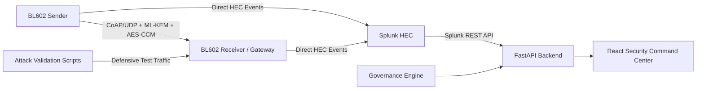
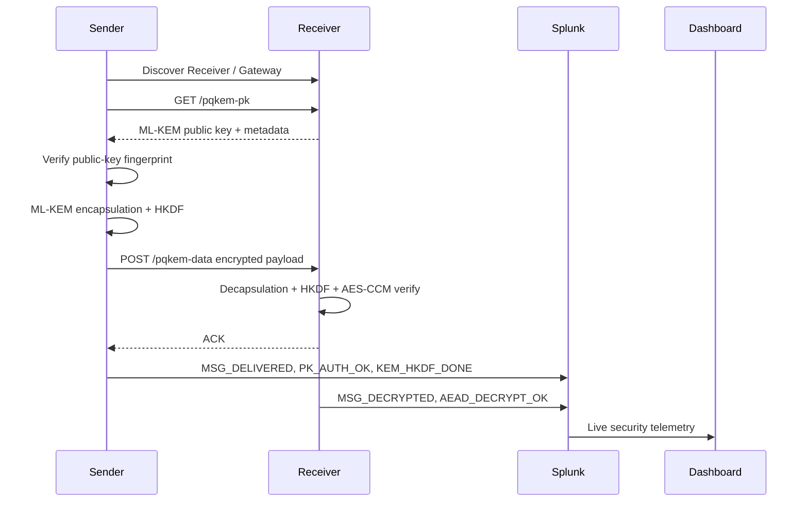
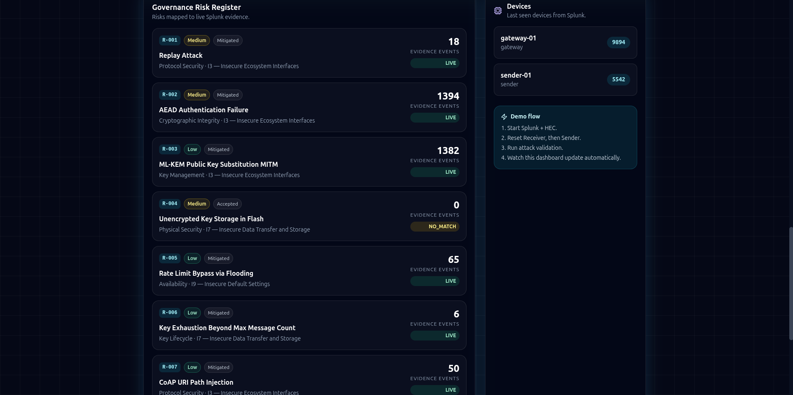
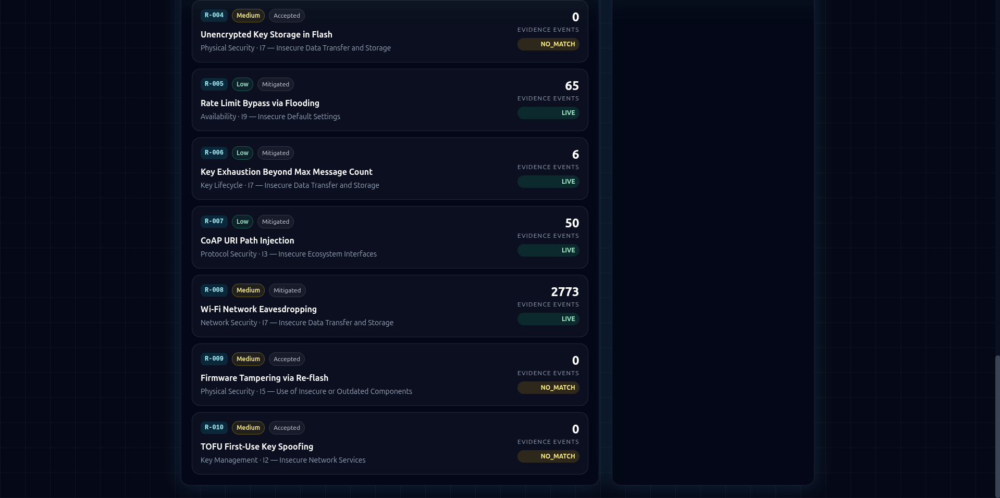
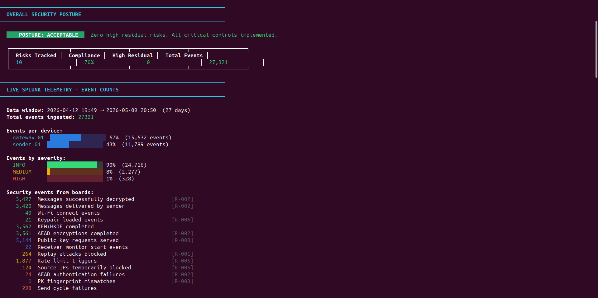
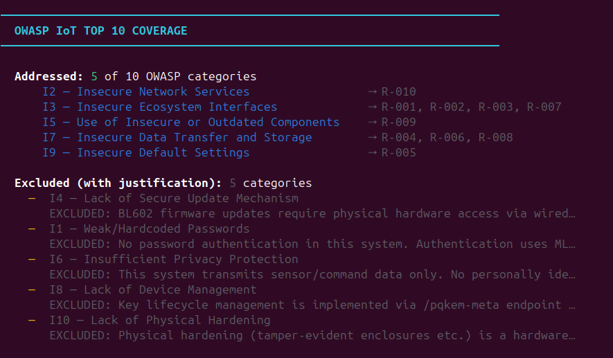
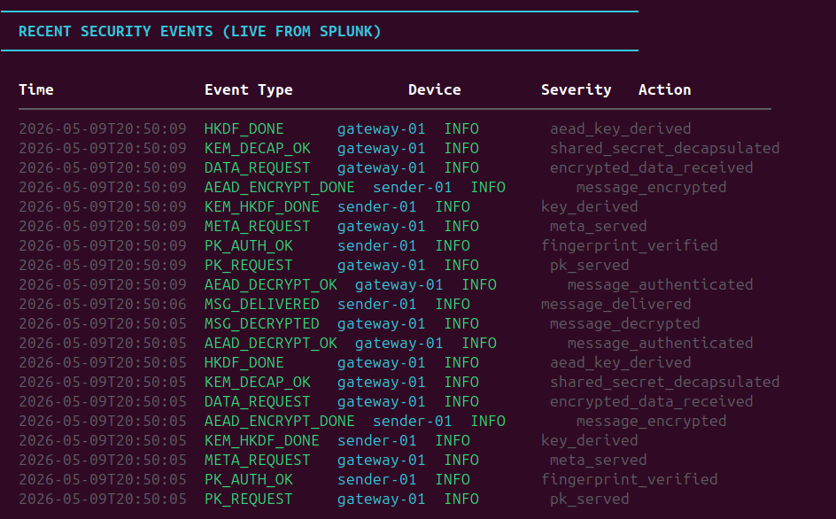
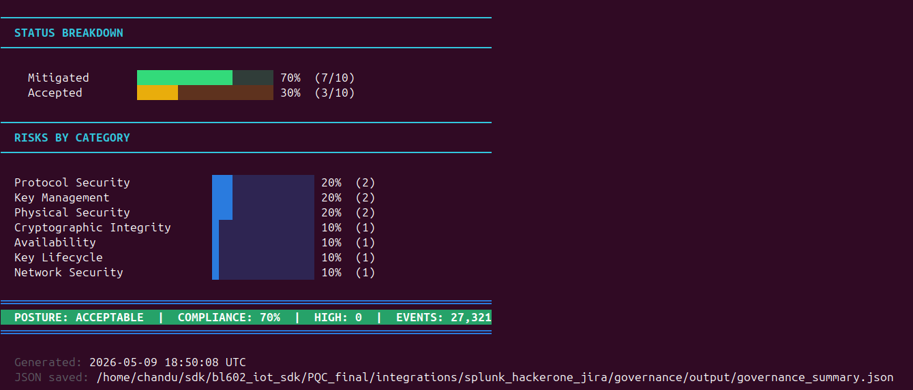

# Post-Quantum Secure IoT Command Center for Real-Time Threat Detection and Governance Monitoring

[](https://opensource.org/licenses/MIT)
[](https://wiki.pine64.org/wiki/PineCone)
[](https://csrc.nist.gov/projects/post-quantum-cryptography)
[](https://www.splunk.com/)
[](#security-command-center-dashboard)

## 🔗 Project Overview

**Post-Quantum IoT Security Command Center** is an end-to-end research prototype for securing constrained IoT communication against current network attacks and future quantum threats. The system uses **BL602 / PineCone** microcontrollers for real embedded communication, **ML-KEM-512** for post-quantum key establishment, **HKDF-SHA-256** for key derivation, and **AES-128-CCM** for authenticated encryption over **CoAP/UDP**.

The project goes beyond a basic encryption demo. It combines secure firmware, live Splunk telemetry, attack validation, governance risk reporting, and a frontend dashboard into one complete cybersecurity pipeline.

> [!NOTE]
> The repository contains firmware for **Sender**, **Receiver/Gateway**, optional **Sniffer**, attack validation scripts, Splunk integration, governance reporting, and a web-based Security Command Center.

> [!IMPORTANT]
> Do not commit real `.env` files, Splunk HEC tokens, Splunk passwords, or generated firmware binaries. Firmware builds can contain build-time telemetry configuration.

---

## 📸 Security Command Center Preview


The dashboard provides one place to view live Splunk telemetry, device status, attack evidence, governance status, and risk posture.

---

## Abstract

Classical public-key cryptography used in IoT deployments may become vulnerable to large-scale quantum computers. This project demonstrates a practical post-quantum secure communication prototype on BL602 microcontrollers. A Sender device obtains the Receiver/Gateway public key, verifies its fingerprint, performs ML-KEM-512 encapsulation, derives an AES session key using HKDF-SHA-256, and transmits an AES-128-CCM protected CoAP message. The Receiver validates sender identity, key identifier, sequence freshness, nonce reuse, and authentication tags before decrypting the payload.

Security events generated by the boards are forwarded to Splunk through HTTP Event Collector. A FastAPI backend reads Splunk events and exposes them to a React-based Security Command Center. The project also includes attack validation and governance mapping to OWASP IoT-style risks. This creates a full pipeline from embedded cryptographic protection to SOC monitoring and compliance evidence.

---

## System Scenario

The system implements a layered secure IoT communication model with monitoring and governance evidence.

- The **Sender** connects to Wi-Fi, discovers the Receiver/Gateway, obtains the public key, verifies the fingerprint, performs ML-KEM encapsulation, encrypts application data, and sends protected CoAP traffic.
- The **Receiver/Gateway** stores or generates an ML-KEM key pair, serves its public key, receives encrypted data, decapsulates the KEM ciphertext, derives the same AES key, verifies AES-CCM authentication, and decrypts the payload.
- **Splunk** receives live telemetry events such as `PK_AUTH_OK`, `KEM_HKDF_DONE`, `MSG_DELIVERED`, `MSG_DECRYPTED`, `REPLAY_REJECT`, and `AEAD_AUTH_FAIL`.
- The **Security Command Center** visualizes live events, attack results, governance evidence, and device status.

---

## High-Level Architecture



> 📌 Optional image slot: replace this Mermaid diagram with your own architecture image if needed.
>
> ```markdown
> 
> ```

---

## Protocol Flow

1. Sender and Receiver boot and connect to the same Wi-Fi network.
2. Receiver loads or generates its long-term ML-KEM-512 key pair.
3. Sender discovers the Receiver/Gateway automatically.
4. Sender requests Receiver public key using the `/pqkem-pk` CoAP endpoint.
5. Sender verifies the Receiver public-key fingerprint.
6. Sender performs ML-KEM-512 encapsulation and obtains a shared secret.
7. Sender derives an AES-128 key using HKDF-SHA-256.
8. Sender encrypts the application message using AES-128-CCM.
9. Receiver validates sender ID, key ID, sequence number, nonce freshness, and AEAD tag.
10. Receiver decrypts the message and reports telemetry to Splunk.



---

## Repository Structure

```text
PQC_final/
├── sender/                         # BL602 Sender firmware
├── Receiver/                       # BL602 Receiver/Gateway firmware
├── sniffer/                        # Optional Wi-Fi sniffer firmware/tools
├── host-tools/                     # Provisioning and helper tools
├── pqc_attacks/                    # Defensive attack validation suite
├── integrations/
│   └── splunk_hackerone_jira/
│       ├── splunk/                 # Splunk discovery, HEC helpers, dashboards
│       └── governance/             # Live governance report and risk mapping
├── dashboard/
│   ├── backend/                    # FastAPI backend for dashboard APIs
│   └── frontend/                   # React frontend Security Command Center
├── docs/
│   └── images/                     # README screenshots and documentation images
├── tools/                          # Build and run scripts
├── .env.example                    # Safe environment template
└── README.md
```

---

## What This Project Does

### Sender Firmware

1. Connects to Wi-Fi.
2. Discovers Receiver/Gateway automatically.
3. Retrieves Receiver public key via `/pqkem-pk`.
4. Verifies the public-key fingerprint.
5. Performs ML-KEM-512 encapsulation.
6. Derives AES key using HKDF-SHA-256.
7. Encrypts the message using AES-128-CCM.
8. Sends protected data via `/pqkem-data`.
9. Sends direct telemetry to Splunk.

### Receiver / Gateway Firmware

1. Connects to Wi-Fi.
2. Loads or generates ML-KEM-512 key pair.
3. Serves public key and metadata endpoints.
4. Receives encrypted CoAP data.
5. Validates sender ID, key ID, sequence number, and nonce freshness.
6. Performs ML-KEM decapsulation.
7. Derives AES key using HKDF-SHA-256.
8. Authenticates and decrypts using AES-128-CCM.
9. Rejects replayed, malformed, tampered, and unauthorized packets.
10. Sends direct telemetry to Splunk.

### Splunk and Dashboard Layer

1. Boards send events to Splunk HEC.
2. Backend queries Splunk REST API.
3. Dashboard displays telemetry and risk evidence.
4. Governance engine maps events to project risks.
5. Attack validation results are visible in one UI.

---

## Runtime Firmware Evidence

### Sender Serial Output

The Sender repeatedly verifies the Receiver fingerprint, performs KEM/HKDF, encrypts the message, receives an ACK, and sends telemetry events.


### Receiver Serial Output

The Receiver accepts `/pqkem-pk`, `/pqkem-meta`, and `/pqkem-data` requests, decapsulates the KEM ciphertext, authenticates the message, decrypts the payload, and reports `MSG_DECRYPTED`.


---

## Security Command Center Dashboard

The React dashboard provides a live view of the system status. It is designed for SOC-style presentation and project demonstration.

### Overview Page


### Live Event Timeline and Attack Validation


### Governance Risk Register





---

## Cryptographic Design

The project follows a clean **KEM → KDF → AEAD** design.

```text
ML-KEM-512 shared secret
        ↓
HKDF-SHA-256
        ↓
AES-128 session key
        ↓
AES-128-CCM authenticated encryption
```

### ML-KEM-512

- Provides post-quantum key establishment.
- Sender encapsulates using Receiver public key.
- Receiver decapsulates using private key.
- Both sides obtain the same shared secret.

### HKDF-SHA-256

- Derives a clean AES session key from the ML-KEM shared secret.
- Avoids direct use of raw KEM output.
- Binds the session key to protocol context.

### AES-128-CCM

- Provides confidentiality and integrity.
- Rejects modified ciphertext, nonce, or tag.
- Suitable for compact IoT messages.

---

## Security Features

| Security Property | Mechanism | Evidence Event |
|---|---|---|
| Post-quantum key establishment | ML-KEM-512 | `KEM_HKDF_DONE`, `KEM_DECAP_OK` |
| Key derivation | HKDF-SHA-256 | `HKDF_DONE` |
| Payload confidentiality | AES-128-CCM | `AEAD_ENCRYPT_DONE`, `MSG_DECRYPTED` |
| Payload integrity | AES-CCM authentication tag | `AEAD_AUTH_FAIL` |
| Public-key authenticity | Fingerprint pinning | `PK_AUTH_OK`, `PK_AUTH_FAIL` |
| Replay protection | Sequence + nonce validation | `REPLAY_REJECT` |
| Sender validation | Sender ID check | `SENDER_AUTH_FAIL` |
| Rate-limit protection | Request throttling/blocking | `RATE_LIMIT_HIT`, `SOURCE_BLOCKED` |
| Governance evidence | Risk-to-event mapping | Governance dashboard |

---

## Threat Model

The attacker is assumed to be on the same local Wi-Fi/LAN as the Sender and Receiver. The attacker may:

- observe CoAP/UDP traffic,
- capture encrypted payloads,
- replay old packets,
- tamper with ciphertext,
- send malformed CoAP messages,
- flood the Receiver,
- attempt public-key substitution,
- impersonate an unauthorized Sender.

The attacker is not assumed to have physical access to the Receiver private key or control of the trusted firmware image.

---

## Attack Validation

The project includes defensive validation scripts in `pqc_attacks/`. These scripts are designed for your own lab environment to verify that the Receiver rejects malicious or invalid traffic.

| Test | Attack Type | Expected Result | Splunk Evidence |
|---|---|---|---|
| 01 | Replay attack | Replayed message rejected | `REPLAY_REJECT` |
| 02 | AEAD ciphertext tamper | Modified ciphertext rejected | `AEAD_AUTH_FAIL` |
| 03 | DoS / flood attempt | Rate limit triggered | `RATE_LIMIT_HIT` |
| 04 | Wrong Sender ID | Unauthorized source rejected | `SOURCE_BLOCKED` / `SENDER_AUTH_FAIL` |
| 05 | Malformed CoAP injection | Packet rejected | `SOURCE_BLOCKED` |
| 06 | Public-key substitution | Fingerprint mismatch detected | `PK_AUTH_FAIL` |

Run attack validation:

```bash
cd ~/sdk/bl602_iot_sdk/PQC_final/pqc_attacks
pyenv activate bl_venv
python3 run_all.py
```

Run a single test:

```bash
python3 run_all.py --only 01
python3 run_all.py --only 02
python3 run_all.py --only 03
python3 run_all.py --only 04
python3 run_all.py --only 05
python3 run_all.py --only 06
```

---

## Governance and Risk Reporting

The governance layer maps live Splunk telemetry to risk evidence. It produces a risk posture showing whether technical controls are working.

Example mappings:

| Risk ID | Risk | Live Evidence |
|---|---|---|
| R-001 | Replay Attack | `REPLAY_REJECT` |
| R-002 | AEAD Authentication Failure | `AEAD_AUTH_FAIL` |
| R-003 | ML-KEM Public Key Substitution MITM | `PK_AUTH_FAIL`, `PK_AUTH_OK` |
| R-005 | Rate Limit Bypass via Flooding | `RATE_LIMIT_HIT`, `SOURCE_BLOCKED` |
| R-008 | Wi-Fi Network Eavesdropping | `MSG_DECRYPTED`, encrypted payload evidence |

Run the governance report:

```bash
cd ~/sdk/bl602_iot_sdk/PQC_final
pyenv activate bl_venv

python3 integrations/splunk_hackerone_jira/governance/governance_test_harness.py \
  --env-file .env \
  --splunk-host localhost \
  --splunk-port 8089
```

<details>
<summary><strong>Governance Report Screenshots</strong></summary>












</details>

---

## Hardware Requirements

### Mandatory

- 1 × PineCone / BL602 board as Sender
- 1 × PineCone / BL602 board as Receiver/Gateway
- USB serial connection for each board
- Wi-Fi access point or laptop hotspot
- Linux development machine
- Splunk Enterprise or Splunk local instance

### Optional

- 1 × BL602 board as Wi-Fi Sniffer
- SSD1306 OLED display for Receiver
- External LEDs for status indication

---

## Software Requirements

- Ubuntu/Linux development environment
- BL602 IoT SDK
- RISC-V toolchain included with BL602 SDK
- Python 3.12 or compatible Python environment
- `pyenv` virtual environment, for example `bl_venv`
- Docker optional for external dashboards
- Node.js and npm for frontend development
- Splunk Enterprise with HEC enabled

---

## Environment Configuration

Create a local `.env` file from the template.

```bash
cd ~/sdk/bl602_iot_sdk/PQC_final
cp .env.example .env
nano .env
```

Example safe template:

```bash
SPLUNK_INDEX=pqc_iot

SPLUNK_HEC_URL=http://localhost:8088
SPLUNK_HEC_TOKEN=CHANGE_ME
SPLUNK_SOURCE=pqc_iot_bl602
SPLUNK_SOURCETYPE=pqc:iot:event
SPLUNK_VERIFY_TLS=false
SPLUNK_HEC_PORT=8088

SPLUNK_HOST=localhost
SPLUNK_PORT=8089
SPLUNK_USER=admin
SPLUNK_PASS=CHANGE_ME

PQC_RECEIVER_IP=CHANGE_ME
PQC_RECEIVER_PORT=5683
PQC_SENDER_ID=0x53454E31
PQC_CORRECT_FP=CHANGE_ME_64_HEX_CHARS
```

> [!WARNING]
> Never commit `.env`, real Splunk tokens, Splunk passwords, or generated firmware binaries.

---

## Build Firmware

```bash
cd ~/sdk/bl602_iot_sdk/PQC_final
pyenv activate bl_venv

export BL60X_SDK_PATH=~/sdk/bl602_iot_sdk
export SPLUNK_HEC_TOKEN="YOUR_REAL_SPLUNK_HEC_TOKEN"
unset SPLUNK_STATIC_HOST
export SPLUNK_HEC_PORT="8088"

bash tools/build_firmware.sh --role Receiver --clean
bash tools/build_firmware.sh --role sender --clean
```

---

## Flash Firmware

Check serial ports:

```bash
ls /dev/ttyUSB*
```

Flash Receiver:

```bash
cd ~/sdk/bl602_iot_sdk/PQC_final/Receiver
blflash flash build_out/Receiver.bin --port /dev/ttyUSB1
```

Flash Sender:

```bash
cd ~/sdk/bl602_iot_sdk/PQC_final/sender
blflash flash build_out/sender.bin --port /dev/ttyUSB0
```

---

## Run the System

### Terminal 1 — Start Splunk

```bash
sudo /opt/splunk/bin/splunk start --run-as-root
```

Open Splunk:

```text
http://localhost:8000
```

### Terminal 2 — Start Splunk Discovery Server

```bash
cd ~/sdk/bl602_iot_sdk/PQC_final/integrations/splunk_hackerone_jira/splunk
pyenv activate bl_venv

python3 splunk_discovery_server.py --hec-port 8088 --proactive
```

### Terminal 3 — Start Receiver Monitor

```bash
cd ~/sdk/bl602_iot_sdk/PQC_final
pyenv activate bl_venv

python3 sender/tools/monitor/monitor.py -d /dev/ttyUSB1 -b 2000000
```

Reset the Receiver board.

### Terminal 4 — Start Sender Monitor

```bash
cd ~/sdk/bl602_iot_sdk/PQC_final
pyenv activate bl_venv

python3 sender/tools/monitor/monitor.py -d /dev/ttyUSB0 -b 2000000
```

Reset the Sender board.

---

## Run Security Command Center

Start the dashboard in single-port mode:

```bash
cd ~/sdk/bl602_iot_sdk/PQC_final
pyenv activate bl_venv

bash tools/run_security_command_center_single_port.sh
```

Open:

```text
http://localhost:8090
```

Development mode:

```bash
# Backend
cd ~/sdk/bl602_iot_sdk/PQC_final/dashboard/backend
pyenv activate bl_venv
pip install -r requirements.txt
python3 app.py
```

```bash
# Frontend
cd ~/sdk/bl602_iot_sdk/PQC_final/dashboard/frontend
npm install
npm run dev
```

Open frontend dev server:

```text
http://localhost:5173
```

---

## Splunk Queries

Recent live events:

```spl
index=pqc_iot
| table _time device_id role event_type severity action
| sort - _time
```

Attack evidence:

```spl
index=pqc_iot event_type IN ("REPLAY_REJECT","AEAD_AUTH_FAIL","PK_AUTH_FAIL","RATE_LIMIT_HIT","SOURCE_BLOCKED","SENDER_AUTH_FAIL")
| table _time device_id role event_type severity action src_ip
| sort - _time
```

Event counts:

```spl
index=pqc_iot
| stats count by event_type severity
| sort - count
```

Device status:

```spl
index=pqc_iot
| stats latest(_time) as last_seen count by device_id role
| sort - last_seen
```

---

## Performance Measurements

| Parameter | Typical Result | Meaning |
|---|---:|---|
| ML-KEM encapsulation | ~9–12 ms | Sender creates KEM ciphertext and shared secret |
| ML-KEM decapsulation | ~70–80 ms observed in Receiver logs | Receiver recovers shared secret |
| AES-CCM encryption | ~1–2 ms | Sender protects message |
| AES-CCM decryption | ~1–2 ms | Receiver authenticates/decrypts message |
| Public key size | 800 bytes | ML-KEM-512 public key |
| Ciphertext size | 768 bytes | ML-KEM-512 ciphertext |
| Shared secret size | 32 bytes | Secret input to HKDF |

> [!NOTE]
> Timing values depend on firmware build, compiler settings, board state, and serial logging overhead.

---

## Security Evaluation Summary

| Security Test | Status | Evidence |
|---|---|---|
| Normal encrypted delivery | Verified | `MSG_DELIVERED`, `MSG_DECRYPTED` |
| Fingerprint verification | Verified | `PK_AUTH_OK` |
| AEAD tamper rejection | Verified | `AEAD_AUTH_FAIL` |
| Replay protection | Verified | `REPLAY_REJECT` |
| Flood/rate-limit detection | Verified | `RATE_LIMIT_HIT`, `SOURCE_BLOCKED` |
| Wrong sender rejection | Verified | `SENDER_AUTH_FAIL` |
| Governance mapping | Verified | Dashboard and governance report |

---

## Production Readiness

This project is a strong **research prototype / thesis-ready proof of concept**. It is not presented as a finished commercial IoT product.

For production deployment, the following should be added:

- secure boot,
- signed firmware updates,
- hardware-backed private key storage,
- certificate or signed provisioning,
- stronger fleet management,
- parser fuzzing,
- formal protocol review,
- long-term load testing,
- production-grade key rotation,
- mTLS/TLS-secured telemetry transport where feasible.

---

## GitHub Safety Checklist

Before pushing:

```bash
git status
```

Make sure these are not committed:

```text
.env
*.env
build_out/
*.bin
*.elf
node_modules/
.venv/
real Splunk tokens
real Splunk passwords
```

Recommended `.gitignore`:

```gitignore
.env
*.env
.env.*
!.env.example
__pycache__/
*.pyc
.venv/
venv/
node_modules/
dashboard/frontend/node_modules/
build_out/
*/build_out/
*.bin
*.elf
*.map
*.hex
*.log
output/
*.zip
.vscode/
.idea/
.DS_Store
```

---

## Future Work

- Add secure boot and signed firmware validation.
- Add hardware-backed key storage or secure element support.
- Extend from one Sender to multiple Sender nodes.
- Add production-grade key rotation and revocation.
- Add formal fuzzing for CoAP parsing and packet validation.
- Add stronger provisioning with certificate/signature-based trust.
- Add long-term performance and reliability testing.
- Extend Splunk dashboards with anomaly detection.
- Add Docker-based one-command deployment for the backend and frontend.

---

## Why This Project Matters

Long-lived IoT deployments may remain in the field for many years. Data captured today may still need protection in a post-quantum future. This project demonstrates that post-quantum key establishment, authenticated encryption, live SOC monitoring, attack validation, and governance evidence can be combined in a practical embedded IoT prototype.

The final result is a complete security story:

```text
Secure embedded communication
        ↓
Live Splunk telemetry
        ↓
Attack validation evidence
        ↓
Governance risk mapping
        ↓
Security Command Center dashboard
```
