# Post-Quantum Secure IoT for Real-Time Threat Detection and Governance Monitoring


[](https://opensource.org/licenses/MIT)
[](https://wiki.pine64.org/wiki/PineCone)
[](https://csrc.nist.gov/projects/post-quantum-cryptography)
[](#protocol-flow)
[](#splunk-live-monitoring)
[](#security-command-center-dashboard)
[](#governance-and-risk-reporting)

## 🔗 Project Overview

**Post-Quantum IoT Security Command Center** is an end-to-end cybersecurity research prototype for securing constrained IoT communication against current network attacks and future quantum threats. The system uses **BL602 / PineCone** microcontrollers, **ML-KEM-512** for post-quantum key establishment, **HKDF-SHA-256** for key derivation, and **AES-128-CCM** for authenticated encryption over **CoAP/UDP**.

This repository is not only a firmware project. It combines secure embedded communication, direct Splunk telemetry, defensive attack validation, live governance reporting, and a frontend Security Command Center into one complete security pipeline.

> [!NOTE]
> The project contains BL602 Sender firmware, BL602 Receiver/Gateway firmware, optional sniffer tooling, Splunk integration, attack validation scripts, governance reporting, and a React/FastAPI Security Command Center dashboard.

> [!IMPORTANT]
> Do **not** commit real `.env` files, Splunk HEC tokens, Splunk passwords, generated firmware binaries, or build outputs. Firmware builds can contain build-time telemetry configuration.

---

## Project Preview

### Security Command Center Overview

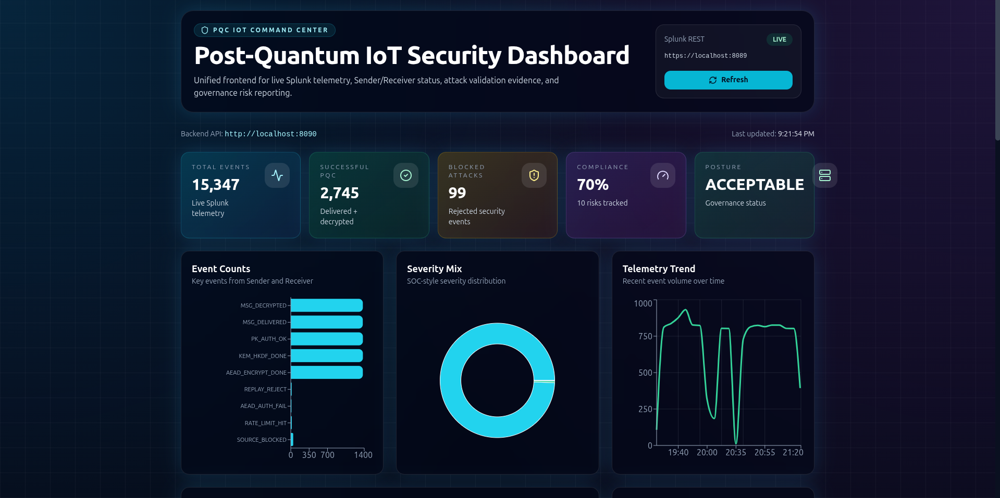

The dashboard gives a SOC-style view of total security events, active devices, attack evidence, compliance posture, and live telemetry collected from Splunk.

---

## Abstract

Classical public-key cryptography used in IoT deployments may become vulnerable when large-scale quantum computers become practical. This project demonstrates a post-quantum secure IoT communication prototype on BL602 microcontrollers. A Sender obtains the Receiver/Gateway public key, verifies the public-key fingerprint, performs ML-KEM-512 encapsulation, derives an AES session key using HKDF-SHA-256, and transmits an AES-128-CCM protected CoAP message. The Receiver validates sender identity, key ID, sequence freshness, nonce reuse, and authentication tags before accepting and decrypting the payload.

The system forwards runtime security events to Splunk using HTTP Event Collector. A FastAPI backend queries Splunk and exposes the data to a React-based Security Command Center. A defensive attack suite validates replay protection, AEAD tamper detection, sender validation, rate limiting, malformed packet handling, and public-key substitution detection. A governance module maps live Splunk evidence to risk controls and produces an audit-ready security posture report.

---

## System Scenario

The system implements a layered secure IoT model with live monitoring and governance evidence.

- The **Sender** connects to Wi-Fi, discovers the Receiver/Gateway, requests the public key, verifies the fingerprint, performs ML-KEM encapsulation, derives an AES key, encrypts the payload, and sends protected CoAP data.
- The **Receiver/Gateway** loads or generates an ML-KEM key pair, serves public-key metadata, decapsulates the KEM ciphertext, derives the AES key, authenticates the message, decrypts valid payloads, and rejects invalid traffic.
- **Splunk** receives runtime events such as `WIFI_CONNECTED`, `PK_AUTH_OK`, `KEM_HKDF_DONE`, `MSG_DELIVERED`, `MSG_DECRYPTED`, `REPLAY_REJECT`, `AEAD_AUTH_FAIL`, and `PK_AUTH_FAIL`.
- The **Security Command Center** visualizes device status, live events, attack validation, governance posture, and risk evidence in a single frontend.

---

## High-Level Architecture

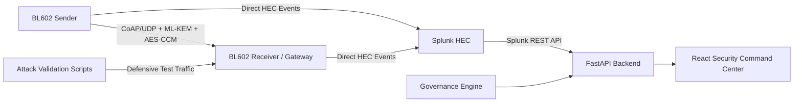

> 📌 Optional image slot for your own architecture diagram:
>
> ```markdown
> 
> ```

---

## Protocol Flow

1. Sender and Receiver boot and connect to the same Wi-Fi network.
2. Receiver loads or generates its ML-KEM-512 key pair.
3. Sender discovers the Receiver/Gateway automatically.
4. Sender requests the Receiver public key using `/pqkem-pk`.
5. Sender verifies the Receiver public-key fingerprint.
6. Sender performs ML-KEM encapsulation and obtains a shared secret.
7. Sender derives an AES-128 key using HKDF-SHA-256.
8. Sender encrypts the application message using AES-128-CCM.
9. Receiver validates sender ID, key ID, sequence number, nonce freshness, and AEAD tag.
10. Receiver decrypts the message, sends an ACK, and reports telemetry to Splunk.

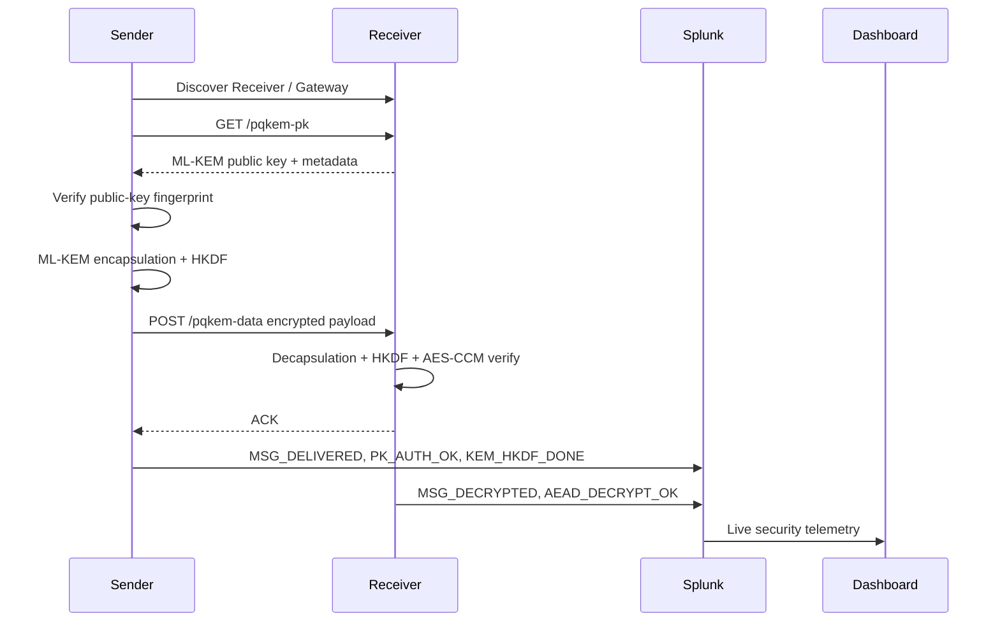


---

## Firmware Runtime Evidence

### Sender Serial Output

The Sender verifies the Receiver fingerprint, completes KEM/HKDF, encrypts the payload, receives ACKs, and reports security events.

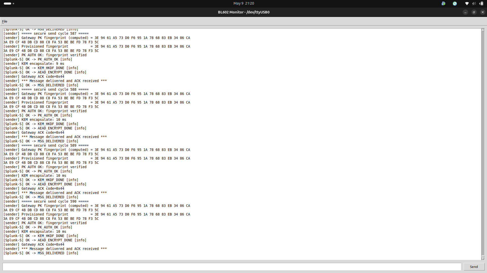

### Receiver Serial Output

The Receiver serves public-key metadata, receives encrypted data, decapsulates the KEM ciphertext, authenticates and decrypts the payload, and reports `MSG_DECRYPTED`.

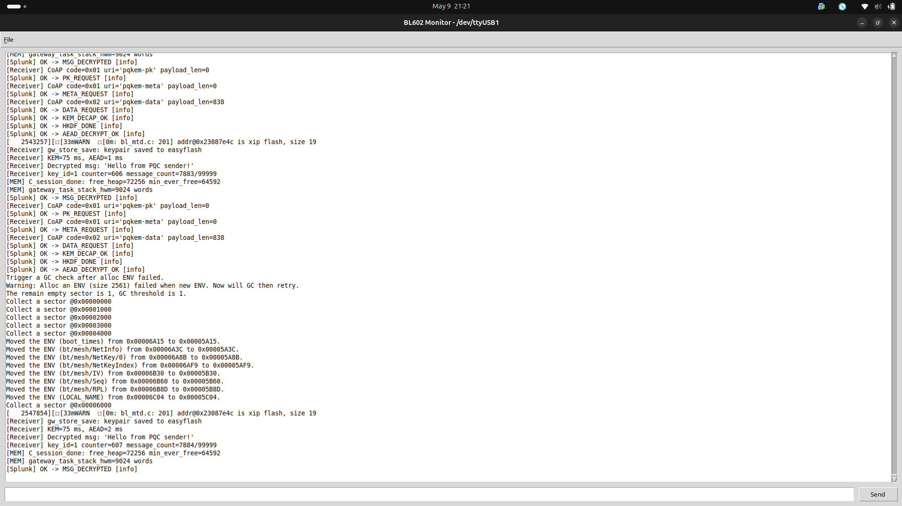

---

## Cryptographic Design

The system follows a clean **KEM → KDF → AEAD** design.

```text
ML-KEM-512 shared secret
        ↓
HKDF-SHA-256
        ↓
AES-128 session key
        ↓
AES-128-CCM authenticated encryption
```

| Layer | Technology | Purpose |
|---|---|---|
| Post-quantum key establishment | ML-KEM-512 | Establish shared secret resistant to quantum attacks |
| Key derivation | HKDF-SHA-256 | Derive protocol-specific AES session key |
| Authenticated encryption | AES-128-CCM | Provide confidentiality, integrity, and tamper detection |
| Transport | CoAP/UDP | Lightweight IoT message transport |
| Monitoring | Splunk HEC | Centralized security telemetry |
| Dashboard | FastAPI + React | SOC-style visualization and governance evidence |

---

## Security Features

| Security Property | Mechanism | Evidence Event |
|---|---|---|
| Post-quantum key establishment | ML-KEM-512 | `KEM_HKDF_DONE`, `KEM_DECAP_OK` |
| Key derivation | HKDF-SHA-256 | `HKDF_DONE` |
| Payload confidentiality | AES-128-CCM | `AEAD_ENCRYPT_DONE`, `MSG_DECRYPTED` |
| Payload integrity | AES-CCM authentication tag | `AEAD_AUTH_FAIL` |
| Public-key authenticity | Fingerprint pinning | `PK_AUTH_OK`, `PK_AUTH_FAIL` |
| Replay protection | Sequence + nonce validation | `REPLAY_REJECT` |
| Sender validation | Sender ID check | `SENDER_AUTH_FAIL` |
| Rate-limit protection | Request throttling/blocking | `RATE_LIMIT_HIT`, `SOURCE_BLOCKED` |
| Governance evidence | Risk-to-event mapping | Governance report and dashboard |

---

## Splunk Live Monitoring

Splunk is the central telemetry layer of the project. The BL602 Sender and Receiver send runtime events directly to Splunk through HTTP Event Collector. The backend then queries Splunk through the REST API and exposes the results to the dashboard and governance module.

### PQC IoT Security Monitoring Dashboard

This Splunk dashboard gives a high-level SIEM view of total events, detected attacks, high-risk events, active devices, event-type distribution, and timeline trends.

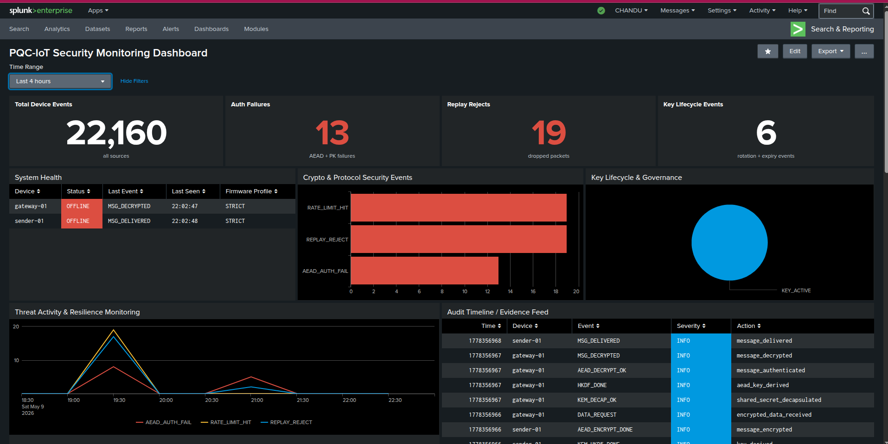

### Splunk-Powered Live Event Timeline

This view shows live event counts and timeline panels generated from the `pqc_iot` index. It helps verify that the Sender and Receiver are continuously forwarding telemetry to Splunk.

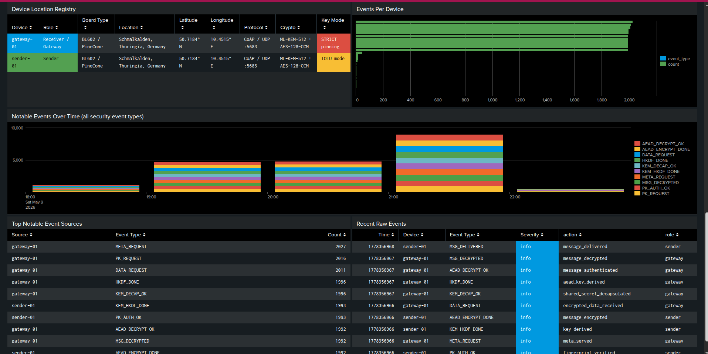

### Recent Security Events and Attack Evidence

This dashboard section highlights recent security events such as `MSG_DECRYPTED`, `PK_AUTH_OK`, `AEAD_AUTH_FAIL`, `REPLAY_REJECT`, `RATE_LIMIT_HIT`, and `SOURCE_BLOCKED`. These events are used later by the governance module as live evidence.

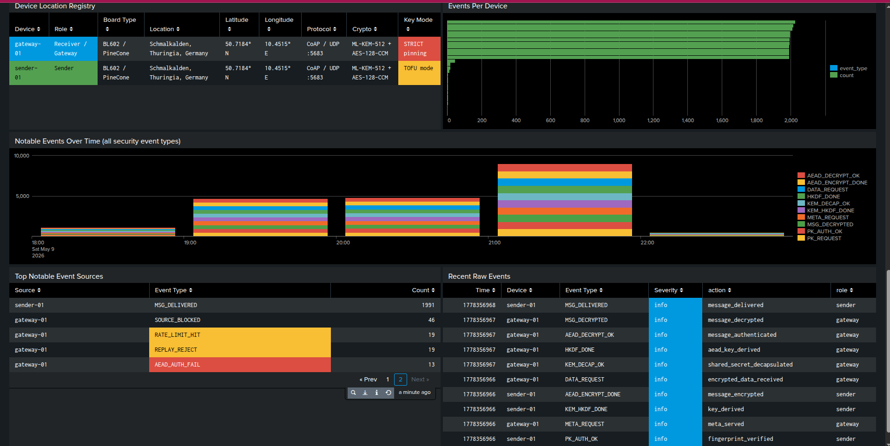

### Example Splunk Queries

Recent board events:

```spl
index=pqc_iot
| table _time device_id role event_type severity action
| sort - _time
```

Attack evidence:

```spl
index=pqc_iot event_type IN ("REPLAY_REJECT","AEAD_AUTH_FAIL","PK_AUTH_FAIL","RATE_LIMIT_HIT","SOURCE_BLOCKED","SENDER_AUTH_FAIL")
| table _time device_id role event_type severity action src_ip
| sort - _time
```

Event counts:

```spl
index=pqc_iot
| stats count by event_type severity
| sort - count
```

Device status:

```spl
index=pqc_iot
| stats latest(_time) as last_seen count by device_id role
| sort - last_seen
```


> 📌 Add your own Splunk Search UI screenshot later if needed:
>
> ```markdown
> 
> ```

---

## Security Command Center Dashboard

The React dashboard provides an attractive SOC-style interface for presenting the project. It visualizes live Splunk telemetry, security events, attack validation evidence, governance status, and device state.

### Overview Dashboard


### Live Events and Attack Validation

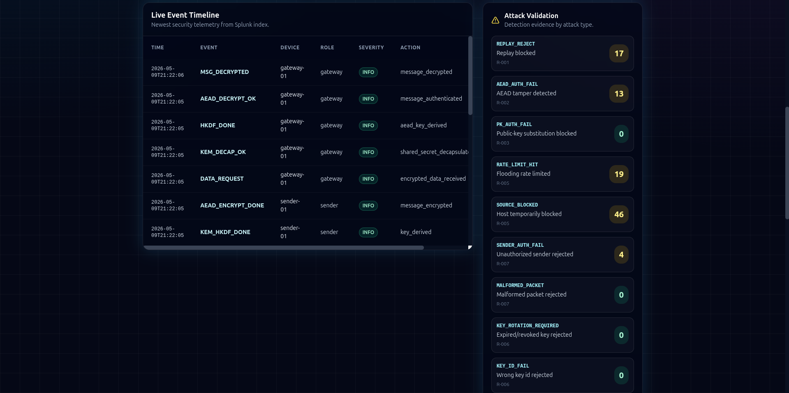

### Governance Compliance View


### Risk Register Detail View


---

## Governance and Risk Reporting

The governance module maps technical telemetry to risk evidence. It converts live Splunk events into a risk posture that can be used for reporting, audit, and conference presentation.

### Live Governance Connection and Overall Posture

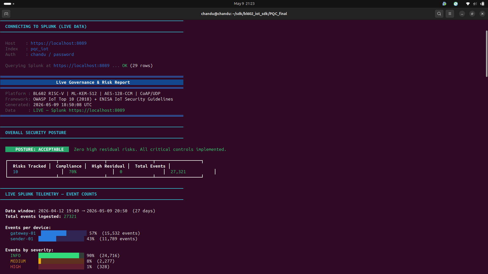

### Live Splunk Telemetry Counts


### Controls Implementation

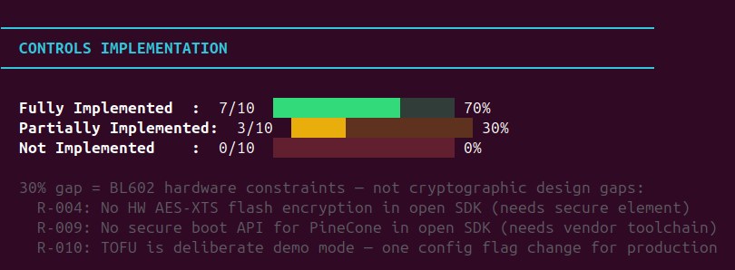

### Full Risk Register with Live Evidence

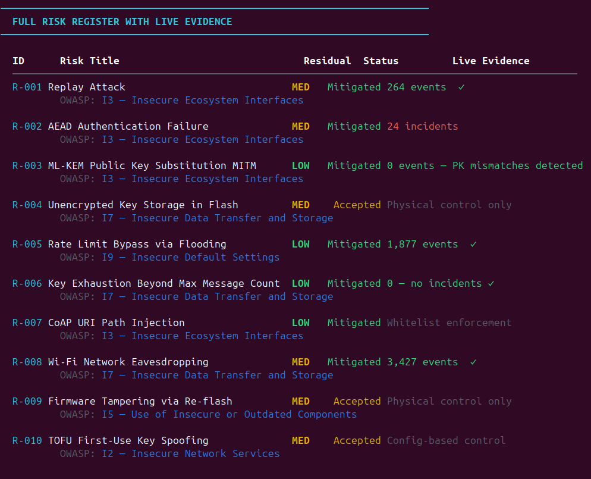

### Residual Risk Breakdown

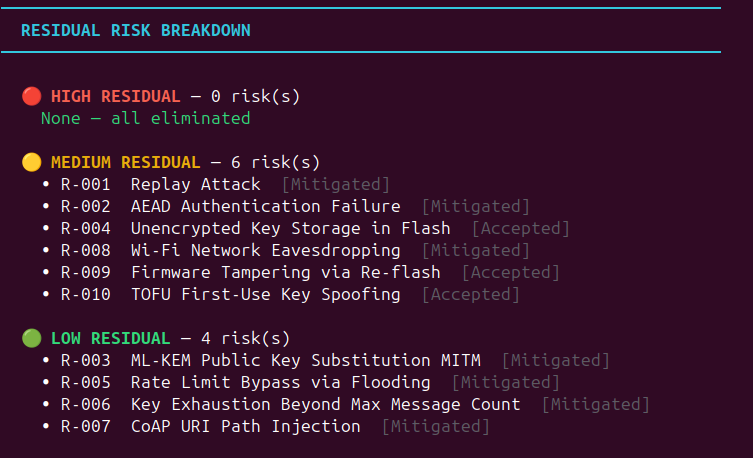

### OWASP IoT Coverage


### Recent Security Events from Splunk


### Compliance Score Explanation

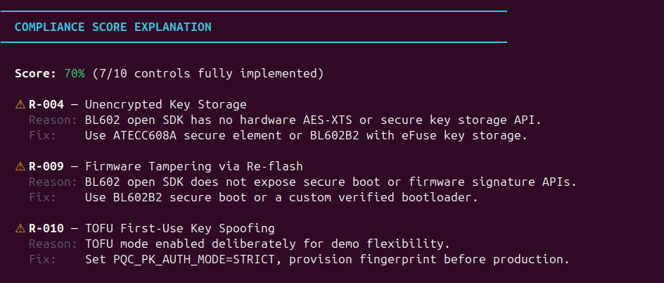

### Status and Category Breakdown


### Risk-to-Evidence Mapping

| Risk ID | Risk | Live Evidence |
|---|---|---|
| R-001 | Replay Attack | `REPLAY_REJECT` |
| R-002 | AEAD Authentication Failure | `AEAD_AUTH_FAIL` |
| R-003 | ML-KEM Public Key Substitution MITM | `PK_AUTH_FAIL`, `PK_AUTH_OK` |
| R-005 | Rate Limit Bypass via Flooding | `RATE_LIMIT_HIT`, `SOURCE_BLOCKED` |
| R-008 | Wi-Fi Network Eavesdropping | `MSG_DECRYPTED`, encrypted payload evidence |

Run the governance report manually:

```bash
cd ~/sdk/bl602_iot_sdk/PQC_final
pyenv activate bl_venv

python3 integrations/splunk_hackerone_jira/governance/governance_test_harness.py \
  --env-file .env \
  --splunk-host localhost \
  --splunk-port 8089
```

---

## Threat Model

The attacker is assumed to be on the same local Wi-Fi/LAN as the Sender and Receiver. The attacker may:

- observe CoAP/UDP traffic,
- capture encrypted payloads,
- replay old packets,
- tamper with ciphertext,
- send malformed CoAP messages,
- flood the Receiver,
- attempt public-key substitution,
- impersonate an unauthorized Sender.

The attacker is not assumed to have physical access to the Receiver private key or control of the trusted firmware image.

---

## Attack Validation

The project includes a defensive attack validation suite in `pqc_attacks/`. These tests are intended for the owner’s local lab environment only.

| Test | Attack Type | Expected Result | Splunk / Governance Evidence |
|---|---|---|---|
| 01 | Replay attack | Replayed packet rejected | `REPLAY_REJECT` |
| 02 | AEAD ciphertext tamper | Modified ciphertext rejected | `AEAD_AUTH_FAIL` |
| 03 | DoS / rate-limit flood | Rate limit triggered | `RATE_LIMIT_HIT` |
| 04 | Wrong Sender ID | Unauthorized sender/source blocked | `SOURCE_BLOCKED`, `SENDER_AUTH_FAIL` |
| 05 | Malformed CoAP injection | Malformed packet rejected | `SOURCE_BLOCKED` |
| 06 | Public-key substitution | Fingerprint mismatch detected | `PK_AUTH_FAIL` |

---

## Hardware Requirements

### Mandatory

- 1 × PineCone / BL602 board as Sender
- 1 × PineCone / BL602 board as Receiver/Gateway
- USB serial connection for each board
- Wi-Fi access point or laptop hotspot
- Linux development machine
- Splunk Enterprise or local Splunk instance

### Optional

- 1 × BL602 board as Wi-Fi Sniffer
- SSD1306 OLED display for Receiver
- External LEDs for status indication

---

## Software Requirements

- Ubuntu/Linux development environment
- BL602 IoT SDK
- RISC-V toolchain included with BL602 SDK
- Python 3.12 or compatible Python environment
- `pyenv` virtual environment, for example `bl_venv`
- Node.js and npm for dashboard frontend
- Splunk Enterprise with HEC enabled

---

## Environment Configuration

Create a local `.env` file from the template.

```bash

cp .env.example .env
nano .env
```

Example safe template:

```bash
SPLUNK_INDEX=pqc_iot

SPLUNK_HEC_URL=http://localhost:8088
SPLUNK_HEC_TOKEN=CHANGE_ME
SPLUNK_SOURCE=pqc_iot_bl602
SPLUNK_SOURCETYPE=pqc:iot:event
SPLUNK_VERIFY_TLS=false
SPLUNK_HEC_PORT=8088

SPLUNK_HOST=localhost
SPLUNK_PORT=8089
SPLUNK_USER=admin
SPLUNK_PASS=CHANGE_ME

PQC_RECEIVER_IP=CHANGE_ME
PQC_RECEIVER_PORT=5683
PQC_SENDER_ID=0x53454E31
PQC_CORRECT_FP=CHANGE_ME_64_HEX_CHARS
```

> [!WARNING]
> Never commit `.env`, real Splunk tokens, Splunk passwords, or generated firmware binaries.

---

## Build and Run

### Build Firmware

```bash
cd PQC_project
pyenv activate bl_venv

export BL60X_SDK_PATH=~/sdk/bl602_iot_sdk
export SPLUNK_HEC_TOKEN="YOUR_REAL_SPLUNK_HEC_TOKEN"
unset SPLUNK_STATIC_HOST
export SPLUNK_HEC_PORT="8088"

bash tools/build_firmware.sh --role Receiver --clean
bash tools/build_firmware.sh --role sender --clean
```

### Flash Firmware

Check serial ports:

```bash
ls /dev/ttyUSB*
```

Flash Receiver:

```bash
cd Receiver
blflash flash build_out/Receiver.bin --port /dev/ttyUSB1
```

Flash Sender:

```bash
cd sender
blflash flash build_out/sender.bin --port /dev/ttyUSB0
```

### Start Splunk

```bash
sudo /opt/splunk/bin/splunk start --run-as-root
```

Open Splunk:

```text
http://localhost:8000
```

### Start Splunk Discovery Server

```bash
cd ~PQC_project/integrations/splunk_hackerone_jira/splunk
pyenv activate bl_venv
python3 splunk_discovery_server.py --hec-port 8088 --proactive
```

### Start Receiver Monitor

```bash
cd PQC_project
pyenv activate bl_venv
python3 sender/tools/monitor/monitor.py -d /dev/ttyUSB1 -b 2000000
```

Reset the Receiver board.

### Start Sender Monitor

```bash
cd PQC_project
pyenv activate bl_venv
python3 sender/tools/monitor/monitor.py -d /dev/ttyUSB0 -b 2000000
```

Reset the Sender board.

---

## Run Security Command Center

Single-port mode:

```bash
cd PQC_project
pyenv activate bl_venv
bash tools/run_security_command_center_single_port.sh
```

Open:

```text
http://localhost:8090
```

Development mode:

```bash
# Backend
cd ~/PQC_project/dashboard/backend
pyenv activate bl_venv
pip install -r requirements.txt
python3 app.py
```

```bash
# Frontend
cd ~/PQC_project/dashboard/frontend
npm install
npm run dev
```

Open frontend dev server:

```text
http://localhost:5173
```

---

## Performance Measurements

| Parameter | Typical Result | Meaning |
|---|---:|---|
| ML-KEM encapsulation | ~9–12 ms | Sender creates KEM ciphertext and shared secret |
| ML-KEM decapsulation | ~70–80 ms observed in Receiver logs | Receiver recovers shared secret |
| AES-CCM encryption | ~1–2 ms | Sender protects message |
| AES-CCM decryption | ~1–2 ms | Receiver authenticates/decrypts message |
| Public key size | 800 bytes | ML-KEM-512 public key |
| Ciphertext size | 768 bytes | ML-KEM-512 ciphertext |
| Shared secret size | 32 bytes | Secret input to HKDF |

> [!NOTE]
> Timing values depend on firmware build, compiler settings, board state, and serial logging overhead.

---

## Security Evaluation Summary

| Security Test | Status | Evidence |
|---|---|---|
| Normal encrypted delivery | Verified | `MSG_DELIVERED`, `MSG_DECRYPTED` |
| Fingerprint verification | Verified | `PK_AUTH_OK` |
| AEAD tamper rejection | Verified | `AEAD_AUTH_FAIL` |
| Replay protection | Verified | `REPLAY_REJECT` |
| Flood/rate-limit detection | Verified | `RATE_LIMIT_HIT`, `SOURCE_BLOCKED` |
| Wrong sender rejection | Verified | `SENDER_AUTH_FAIL` |
| Governance mapping | Verified | Dashboard and governance report |

---

## Production Readiness


- secure boot,
- signed firmware updates,
- hardware-backed private key storage,
- certificate or signed provisioning,
- stronger fleet management,
- parser fuzzing,
- formal protocol review,
- long-term load testing,
- production-grade key rotation,
- mTLS/TLS-secured telemetry transport where feasible.

---

## Future Work

- Add secure boot and signed firmware validation.
- Add hardware-backed key storage or secure element support.
- Extend from one Sender to multiple Sender nodes.
- Add production-grade key rotation and revocation.
- Add formal fuzzing for CoAP parsing and packet validation.
- Add stronger provisioning with certificate/signature-based trust.
- Add long-term performance and reliability testing.
- Extend Splunk dashboards with anomaly detection.
- Add Docker-based one-command deployment for the backend and frontend.

---

## Why This Project Matters

Long-lived IoT deployments may remain in the field for many years. Data captured today may still need protection in a post-quantum future. This project demonstrates that post-quantum key establishment, authenticated encryption, live SOC monitoring, attack validation, and governance evidence can be combined in a practical embedded IoT prototype.

The final result is a complete security story:

```text
Secure embedded communication
        ↓
Live Splunk telemetry
        ↓
Attack validation evidence
        ↓
Governance risk mapping
        ↓
Security Command Center dashboard
```
